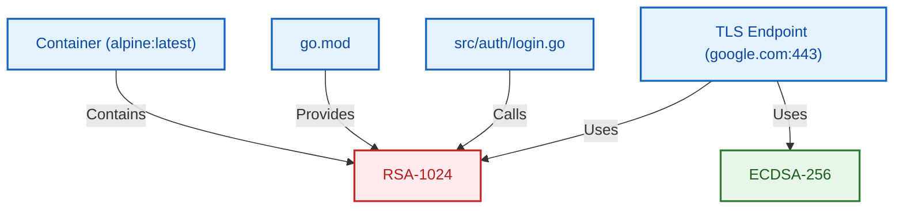

# Spectra: Cryptographic Intelligence Platform

[](https://github.com/HarshalPatel1972/spectra/actions)
[](https://go.dev/)
[](https://opensource.org/licenses/MIT)

> *"See every cipher. Own your migration."*

Spectra is an enterprise-grade **Cryptographic Intelligence Platform** and **PQC Migration Engine**. Built as a fast, zero-dependency Go binary, Spectra scans your source code, configuration files, dependency manifests, live TLS endpoints, and OCI container images to discover exactly what cryptography your organization relies on.

It automatically grades findings against a proprietary **Quantum Risk Score (QRS)**, enforces compliance (CNSA 2.0, NIST), and simulates exactly what will break when you migrate to Post-Quantum Cryptography (PQC).

## Core Capabilities

- **Omni-Asset Scanning**: Deep inspection of Source Code (Go, Python, Java, JS), Certificates, Dependency Manifests, and Config files.
- **Live Infrastructure Interrogation**: Connect to live servers (`spectra endpoint`) or scan Docker images layer-by-layer (`spectra container scan`) without needing a daemon.
- **Compliance Engine**: Instantly flags violations of NSA CNSA 2.0, NIST SP 800-131A, PCI DSS v4.0, and FIPS 140-3 (`spectra compliance`).
- **Cryptographic Knowledge Graph**: Translates your codebase into a dependency graph to calculate the blast radius of deprecating an algorithm (`spectra blast`).
- **Migration Simulation**: Simulates architectural transitions (e.g., RSA to ML-KEM) to detect breaking changes before they happen (`spectra simulate`).
- **Temporal Tracking**: Uses Git Blame to track drift, calculate migration velocity, and project your PQC-Ready Date (`spectra history`).
- **Executive Deliverables**: Generates board-ready HTML reports detailing your Cryptographic Posture Score (CPS) and Cryptographic Agility Index (CAI) (`spectra report executive`), alongside CycloneDX CBOM JSON.

### The Cryptographic Knowledge Graph
Spectra uniquely translates your entire codebase into a dependency graph. This allows you to visually map exactly where weak algorithms are used and calculate the "blast radius" if you deprecate them.



## Quick Start

```bash
# Install via NPM (or use Homebrew / Go Install)
npm install -g spectra-crypto-cli

# 1. Run a persistent scan of your current directory
spectra scan . --persist

# 2. Check the scan against Compliance Frameworks
spectra compliance --scan-id <SCAN-ID>

# 3. Simulate migrating away from an insecure algorithm
spectra simulate --scan-id <SCAN-ID> --from RSA --to ML-KEM

# 4. Generate the Executive Board Report
spectra report executive --scan-id <SCAN-ID>
```

## Output Formats

Spectra outputs data where you need it:
- **Terminal UI**: Beautiful, ANSI-colored tables and alerts.
- **CycloneDX CBOM**: Industry-standard JSON/XML bill of materials.
- **HTML Dashboards**: CISO-level visual reports.
- **GraphViz / Mermaid**: Export your cryptographic architecture visually.

## Database & State

Spectra uses a purely embedded `modernc.org/sqlite` database stored locally at `~/.spectra/state.db`. There are no external databases to configure, no cloud uploads, and your intellectual property never leaves your machine.

## Contributing

Contributions are welcome! Please open an issue before submitting a large PR. Ensure you run `go test ./...` and `golangci-lint` before committing.
